# Medical RAG Q&A

> Retrieval-Augmented Generation over clinical guidelines — with refusal logic, source citations, RAGAS evaluation, and a full engineering stack.


---

## Problem Statement

Medical professionals and researchers need fast, **trustworthy** answers from dense clinical documents — WHO Essential Medicines Lists, IDF insulin therapy guidelines, palliative care protocols. A generic chatbot cannot provide this: it hallucinates dosing figures, invents contraindications, and cites nothing.

This project builds a RAG system that:

- **Only answers from retrieved evidence** — if the maximum cosine similarity of retrieved chunks falls below 0.35, the system refuses rather than guessing.
- **Cites every claim** — each answer includes the source document, page number, and the exact chunk text that supports it.
- **Quantifies its own quality** — RAGAS `faithfulness` (is the answer grounded in the context?) and `answer_relevancy` (does the answer actually address the question?) are measured across 22 medical test queries.

The result is the kind of trustworthy AI system that distinguishes a senior ML engineer from someone who glued together a chatbot.

---

## Architecture

```mermaid
flowchart LR
    subgraph L1["Layer 1 — Ingestion"]
        A[PDF Parser\nPyMuPDF] --> B[Chunker\nfixed / sentence / semantic]
        B --> C[Metadata\npage · doc · section]
    end

    subgraph L2["Layer 2 — Embedding"]
        D[all-MiniLM-L6-v2\n384-dim · CPU-only]
    end

    subgraph L3["Layer 3 — Retrieval"]
        E[Qdrant\nvector store] --> F[Top-20 candidates\ncosine similarity]
        F --> G[CrossEncoder\nms-marco-MiniLM-L-6-v2\nreranker → Top-5]
    end

    subgraph L4["Layer 4 — Generation"]
        H[Refusal gate\nmax_score < 0.35] --> I[Prompt builder\nnumbered context blocks]
        I --> J[Groq LLM\nllama-3.3-70b-versatile]
        J --> K[Citation extractor\nN → source doc · page]
    end

    subgraph L5["Layer 5 — API + Evaluation"]
        L[FastAPI\nPOST /ask\nGET /health]
        M[RAGAS\nfaithfulness\nanswer_relevancy]
        N[LangChain LCEL\nvs LlamaIndex\npipeline comparison]
    end

    subgraph L6["Layer 6 — Infrastructure"]
        O[Docker Compose\nQdrant + FastAPI]
        P[GitHub Actions\nlint + pytest on push]
        Q[Gradio\nHuggingFace Spaces demo]
    end

    C --> D --> E
    G --> H
    K --> L
    L --> M
    L --> N
    O & P & Q
```



---

## Results

> Results are populated after running evaluation with a live Qdrant instance and a valid `GROQ_API_KEY`.
> Run `python -m src.evaluation.chunking_comparison` to generate the CSV and chart in `reports/figures/`.

### Chunking Strategy Comparison

| Strategy | Faithfulness | Answer Relevancy | Avg Latency (ms) |
|---|---|---|---|
| Fixed-size (512 tokens, 64 overlap) | — | — | — |
| Sentence-boundary | — | — | — |
| Semantic (embedding similarity) | — | — | — |

### Framework Comparison

| Framework | Faithfulness | Answer Relevancy | Avg Latency (ms) |
|---|---|---|---|
| Custom pipeline (CrossEncoder reranker) | — | — | — |
| LangChain LCEL | — | — | — |
| LlamaIndex RetrieverQueryEngine | — | — | — |

---

## Key Features

| Feature | Detail |
|---|---|
| **Refusal logic** | Returns `"I cannot answer from the provided documents."` when max retrieval score < 0.35 — never hallucinates |
| **Source citations** | Every answer maps `[N]` markers back to exact chunk text, page number, and source document |
| **Cross-encoder reranking** | Top-20 cosine candidates re-scored by `ms-marco-MiniLM-L-6-v2`; only top-5 reach the LLM |
| **3 chunking strategies** | Fixed-size, sentence-boundary, and semantic chunking — compared via RAGAS |
| **RAGAS evaluation** | Faithfulness + answer relevancy scored across 22 medical test queries with ground-truth answers |
| **Framework comparison** | Same query interface implemented in LangChain LCEL and LlamaIndex for side-by-side benchmarking |
| **Type-safe API** | Pydantic-validated FastAPI endpoints with full OpenAPI schema generation |
| **252 tests** | Every module has mocked unit tests; no real Qdrant or LLM required to run the test suite |

---

## Tech Stack

| Component | Technology |
|---|---|
| PDF parsing | PyMuPDF (`fitz`) |
| Chunking | Custom fixed-size, sentence-boundary, semantic (embedding cosine similarity) |
| Embeddings | `sentence-transformers/all-MiniLM-L6-v2` — 384-dim, CPU-only, ~80 MB |
| Vector store | Qdrant (Docker) — metadata filtering, payload indexing |
| Reranker | `cross-encoder/ms-marco-MiniLM-L-6-v2` — catches semantic mismatches cosine similarity misses |
| LLM | Groq API — `llama-3.3-70b-versatile` (free tier, OpenAI-compatible REST) |
| RAG framework A | LangChain 1.2 LCEL chain |
| RAG framework B | LlamaIndex 0.14 `RetrieverQueryEngine` |
| Evaluation | RAGAS 0.4 — faithfulness + answer relevancy |
| API | FastAPI 0.111 + Uvicorn |
| Demo UI | Gradio 4.x — deployable to HuggingFace Spaces |
| Containerisation | Docker + Docker Compose |
| CI/CD | GitHub Actions — ruff lint + pytest on every push to `main` |
| Config | `python-dotenv` — all secrets in `.env`, never hardcoded |

---

## How to Run

### Local setup

```bash
# 1. Clone and install
git clone https://github.com/YasinduKaveesha/medical-rag-qa.git
cd medical-rag-qa
pip install -e ".[dev]"

# 2. Configure environment
cp .env.example .env
# Edit .env — set GROQ_API_KEY=gsk-...

# 3. Start Qdrant
docker run -d -p 6333:6333 qdrant/qdrant:v1.9.2

# 4. Ingest documents  (place PDFs in data/raw/ first)
python -m src.ingestion.pdf_parser
python -m src.ingestion.chunkers

# 5. Start the API
uvicorn app.main:app --reload
```

### Docker Compose (recommended)

```bash
# 1. Set your Groq API key
export GROQ_API_KEY=gsk-...

# 2. Build and start Qdrant + FastAPI
docker compose up --build -d

# 3. Ask a question
curl -s -X POST http://localhost:8000/ask \
  -H "Content-Type: application/json" \
  -d '{"question": "What is the recommended starting dose of amitriptyline for neuropathic pain?"}' \
  | python -m json.tool
```

Health check:

```bash
curl http://localhost:8000/health
```

### Gradio demo

```bash
# Requires the FastAPI service to be running
python app/gradio_demo.py
# Opens at http://localhost:7860
# Set FASTAPI_URL env var to point at a remote API for HuggingFace Spaces deployment
```

---

## API Documentation

### `POST /ask`

Ask a clinical question. The system retrieves relevant chunks, checks confidence, and returns a cited answer.

**Request body**

```json
{
  "question": "What is the recommended starting dose of amitriptyline for neuropathic pain?",
  "filters": null
}
```

| Field | Type | Required | Description |
|---|---|---|---|
| `question` | string | yes | The clinical question |
| `filters` | object \| null | no | Qdrant payload filter (e.g. `{"document_type": "essential_medicines_list"}`) |

**Response `200 OK`**

```json
{
  "answer": "The recommended starting dose of amitriptyline for neuropathic pain is 10 to 25 mg orally at night [1], titrated upward based on response and tolerability [2].",
  "sources": [
    {
      "claim": "The recommended starting dose of amitriptyline for neuropathic pain is 10 to 25 mg orally at night [1]",
      "source_chunk": "Amitriptyline 10–25 mg at night. Dose may be increased to 75 mg at night if necessary.",
      "page_number": 3,
      "source_document": "WHO-MHP-HPS-EML-2023.02-eng.pdf"
    }
  ],
  "confidence": 0.8741,
  "model_version": "llama-3.3-70b-versatile"
}
```

**Refusal response** (when max retrieval score < 0.35):

```json
{
  "answer": "I cannot answer from the provided documents.",
  "sources": [],
  "confidence": 0.2103,
  "model_version": "llama-3.3-70b-versatile"
}
```

**Error responses**

| Code | Condition |
|---|---|
| `400` | Empty or whitespace-only question |
| `422` | Request body fails Pydantic validation |
| `503` | Qdrant is unreachable |
| `500` | Unexpected internal error |

---

### `GET /health`

Returns service status and Qdrant collection statistics. Always returns `200` — callers inspect the `status` field.

**Response `200 OK` — healthy**

```json
{
  "status": "ok",
  "model_version": "llama-3.3-70b-versatile",
  "collection_info": {
    "name": "medical_docs",
    "vectors_count": 1842,
    "points_count": 1842,
    "status": "green"
  }
}
```

**Response `200 OK` — degraded** (Qdrant unreachable):

```json
{
  "status": "degraded",
  "model_version": "llama-3.3-70b-versatile",
  "collection_info": {
    "error": "Qdrant unavailable"
  }
}
```

---

## Project Structure

```
medical-rag-qa/
├── Dockerfile                          # Python 3.11-slim, uvicorn entrypoint
├── docker-compose.yml                  # Qdrant + FastAPI on shared rag-net
├── pyproject.toml                      # deps, ruff config, pytest config
├── .env.example                        # env var template (copy to .env)
├── .github/
│   └── workflows/
│       └── ci.yml                      # lint + test on push to main
│
├── data/
│   └── raw/                            # place source PDFs here (gitignored)
│
├── src/
│   ├── config.py                       # Settings dataclass + get_settings() singleton
│   ├── ingestion/
│   │   ├── pdf_parser.py               # PyMuPDF page extraction
│   │   ├── chunkers.py                 # fixed-size / sentence / semantic chunking
│   │   └── metadata.py                 # chunk metadata builder
│   ├── embeddings/
│   │   └── encoder.py                  # EmbeddingEncoder wrapping sentence-transformers
│   ├── retrieval/
│   │   ├── vector_store.py             # QdrantStore (upsert, search, collection info)
│   │   ├── reranker.py                 # CrossEncoderReranker
│   │   └── pipeline.py                 # RetrievalPipeline (encode → search → rerank)
│   ├── generation/
│   │   ├── prompt_builder.py           # numbered context-block prompt assembly
│   │   ├── llm_client.py               # LLMClient wrapping Groq via openai SDK
│   │   ├── refusal.py                  # should_refuse() — max_score < threshold
│   │   └── citations.py                # extract_citations() — [N] → source chunk
│   ├── evaluation/
│   │   ├── test_queries.json           # 22 medical Q&A pairs with ground truth
│   │   ├── ragas_eval.py               # RAGAS faithfulness + answer_relevancy pipeline
│   │   └── chunking_comparison.py      # compare 3 strategies across RAGAS metrics
│   └── frameworks/
│       ├── langchain_pipeline.py       # LangChain LCEL pipeline
│       └── llamaindex_pipeline.py      # LlamaIndex RetrieverQueryEngine pipeline
│
├── app/
│   ├── main.py                         # FastAPI app — POST /ask, GET /health
│   ├── schemas.py                      # Pydantic request/response models
│   └── gradio_demo.py                  # Gradio UI → HuggingFace Spaces
│
├── tests/
│   ├── test_config.py                  #  5 tests
│   ├── test_ingestion.py               # 24 tests
│   ├── test_embeddings.py              # 19 tests
│   ├── test_chunking.py                # 35 tests
│   ├── test_vector_store.py            # 27 tests
│   ├── test_reranker.py                # 20 tests
│   ├── test_retrieval_pipeline.py      # 22 tests
│   ├── test_generation.py              # 34 tests
│   ├── test_api.py                     # 22 tests
│   ├── test_evaluation.py              # 23 tests
│   └── test_frameworks.py              # 21 tests  ← 252 total
│
└── reports/
    └── figures/                        # RAGAS CSVs + charts written here
```

---

## Evaluation

### RAGAS metrics

| Metric | What it measures | Range |
|---|---|---|
| **Faithfulness** | Is every claim in the answer supported by the retrieved context? (LLM-judged) | 0 – 1 |
| **Answer Relevancy** | Does the answer actually address the question? (embedding similarity) | 0 – 1 |

A high-faithfulness, high-relevancy answer is grounded **and** on-topic. Refusals score low on both — correctly signalling that retrieval failed, not that the LLM failed.

### Running evaluation

```bash
# Standard eval on the default collection
python -m src.evaluation.ragas_eval

# Chunking strategy comparison (requires 3 pre-ingested collections)
python -m src.evaluation.chunking_comparison

# Override collection names
COLLECTION_FIXED=my_fixed \
COLLECTION_SENTENCE=my_sentence \
COLLECTION_SEMANTIC=my_semantic \
python -m src.evaluation.chunking_comparison
```

Output files (timestamped) are written to `reports/figures/`:

| File | Contents |
|---|---|
| `ragas_results_<ts>.csv` | Per-query faithfulness + answer_relevancy scores |
| `ragas_scores_<ts>.png` | Mean score bar chart |
| `chunking_comparison_<ts>.csv` | Per-strategy mean ± std dev summary |
| `chunking_comparison_<ts>.png` | Grouped bar chart with error bars |

> **Rate limiting:** evaluation uses `RunConfig(max_retries=10, max_wait=60)` and `batch_size=5` to stay within Groq's free tier. A 1-second sleep between queries is enabled by default.

---

## Testing

All 252 tests run with mocked dependencies — no Qdrant instance, no Groq API key, and no model downloads required.

```bash
# Run all tests
pytest tests/ -v

# Run a single module
pytest tests/test_generation.py -v

# With short tracebacks (matches CI)
pytest tests/ --tb=short
```

| Test file | Tests | What it covers |
|---|---|---|
| `test_config.py` | 5 | Settings loading, singleton, missing key |
| `test_ingestion.py` | 24 | PDF parsing, metadata extraction |
| `test_embeddings.py` | 19 | Encoder encode/batch, singleton |
| `test_chunking.py` | 35 | Fixed-size, sentence, semantic chunking |
| `test_vector_store.py` | 27 | QdrantStore upsert, search, collection info |
| `test_reranker.py` | 20 | CrossEncoder scoring, top-k selection |
| `test_retrieval_pipeline.py` | 22 | End-to-end retrieve → rerank |
| `test_generation.py` | 34 | Prompt builder, LLM client, refusal, citations |
| `test_api.py` | 22 | FastAPI `/ask` and `/health` via TestClient |
| `test_evaluation.py` | 23 | RAGAS dataset building, save, comparison |
| `test_frameworks.py` | 21 | LangChain and LlamaIndex pipeline queries |
| **Total** | **252** | |

---

## License

[MIT](LICENSE)
